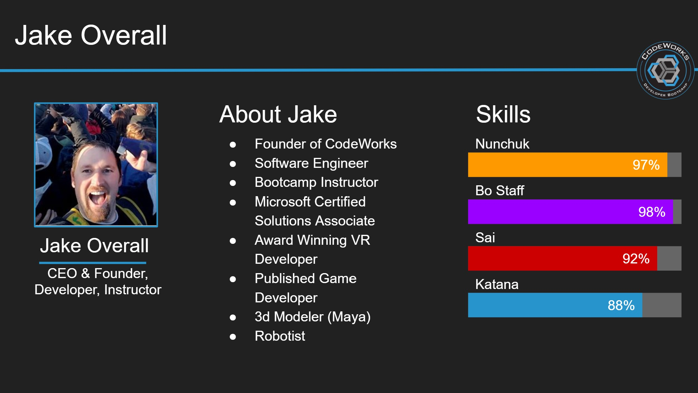

<h2 align="center">I 💖 Coding and Educating!</h2>

From "Hello, World!" My passion for development has only grown. The critical thinking that coding demands in building each attribute of an application that is user friendly, functional, secure, and visually appealing is thrilling. I love the continuous learning and creativity that comes with being a software engineer.

I am a Microsoft Certified Professional, an award winning VR Developer and have published several successful video games to the steam platform. I also maintain several open source libraries and tools focused around AppSec and web dev.

I am an active member and organizer of two technical meetup groups and believe in the importance of giving back to the community through networking opportunities and education. 
  
As an Entrepreneur and Founder of [CodeWorks](https://boisecodeworks.com), a development bootcamp, I have over 6 years of experience running a company as the CEO. I also am an instructor and teach people the skills needed to become Software Developers and Cyber Security Professionals. As the Head Instructor I have designed the CodeWorks curriculum to stay focused on real world needs. 

Ultimately I love to see the success of my students as they learn the skills they need to start working in the tech industry. I have seen people from various backgrounds, Roofers, Steelworkers leave their dangerous, labor intensive careers and find success with the education that we provide to them at CodeWorks as they Develop Their Future.

For fun I am one of the hosts of <a href="https://open.spotify.com/show/5iDwn9sntA8dlZVPCNCAwZ" title="The Dev Team Podcast" target="_blank">CodeWorks The Dev Team</a> and a founders of a successfully launched [kickstarter](https://www.kickstarter.com/projects/markohnsman/atlas-worlds-build-your-worlds-on-our-shoulders) <a href="https://atlasworlds.com" target="_blank" title="Atlas Worlds">Atlas Worlds</a>

<h5 align="center">
  
</h5>

  
  &nbsp;
  
  &nbsp;
  

---

  

  

- [**Project Stats**](https://npm-stat.com/charts.html?package=%40bcwdev%2Fquickvue&package=%40bcwdev%2Fauth0provider-client&package=%40bcwdev%2Fauth0provider&package=bcw&from=2019-07-01&to=2021-12-14)

